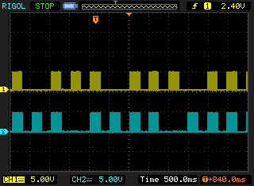

# Cable Tracer

## Summary

This project was designed to trace multiple unmarked TV aerial cables by simultaneously outputting 1-12 tone pulses on pins D13,D2-D12 of an Arduino Nano.

* Pulses are approx 250ms long with 250ms gap and 261Hz (Middle C)
* A missing pulse identifies each pulse sequence
* Pulses may be observed with an LED and / or speaker
* Use 220R resistors to connect Port pins and 0V to cables under test

For your own safety ensure that wires under investigation are safe before connecting this device.

## Scope display

Outputs D3 and D4.